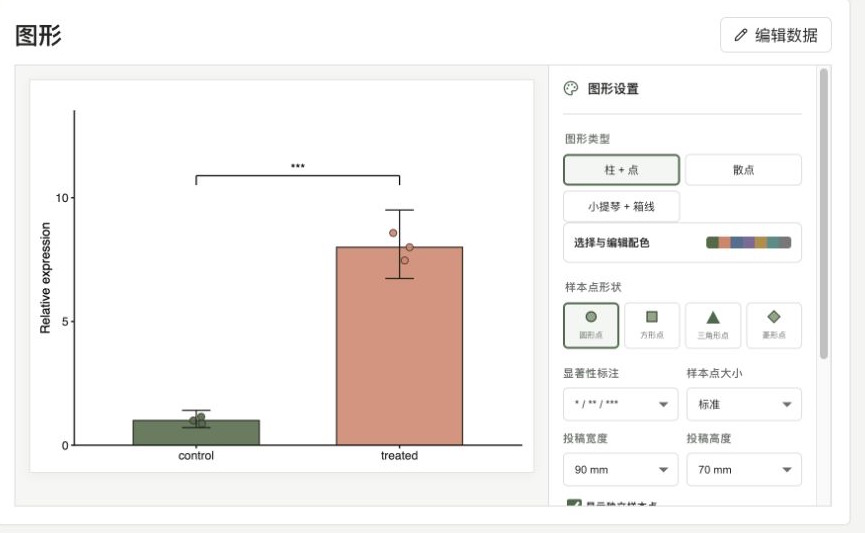

# qPCR Helper

把 Ct 值整理成结果和图的 qPCR 小工具。

将逐孔 Ct/Cq 粘贴进表格，或上传 CSV/XLSX，选择内参和分组后点击分析。qPCR Helper 会计算 ΔCt、ΔΔCt 和 `2^-ΔΔCt` 表达量，并根据实验设计给出统计方法选项，再生成可以继续调整和下载的科研图。



从数据录入到下载的界面说明（中英双语）：[`docs/module-guide.md`](docs/module-guide.md)。

## 可以做什么

- 柱状图叠加样本点、散点图、小提琴+箱线图、配对图和时间曲线
- 多基因表达热图（ComplexHeatmap）
- Welch t-test、配对 t-test、ANOVA + Tukey、Dunnett、Holm、BH-FDR 等选择
- 点大小、点形状、分组颜色、画布尺寸和显著性标注可即时调整
- SVG、PDF、PNG、TIFF 单图下载，不必先下载整套科研包
- 内置独立两组、配对、单因素、两因素、重复测量和多基因示例

技术重复先做 QC 和汇总，统计 `n` 只计算生物学重复。该工具用于科研分析，不用于临床诊断；正式投稿前仍需结合扩增效率、内参稳定性和实验设计复核结果。

## 在线使用

<https://qpcr-helper-web-production.up.railway.app>

## 本地运行

要求 Node 24、pnpm 11、R 4.4+。

```bash
pnpm install
Rscript services/analysis-r/install.R
ANALYSIS_R_SHARED_SECRET=qpcr-helper-local-dev PORT=8787 HOST=127.0.0.1 Rscript services/analysis-r/run.R
# 另开终端
pnpm dev
```

访问 `http://localhost:3000`。运行检查：

```bash
pnpm test
pnpm typecheck
pnpm lint
Rscript services/analysis-r/tests/test_figures.R
```

## 目录

- `apps/web`：Next.js 界面与 API
- `packages/contracts`：共享数据契约和计算核心
- `services/analysis-r`：统计、绘图和导出
- `supabase`：数据库迁移、RLS 与 Storage 策略

## 对话式分析

如果先用聊天工具整理原始数据，可以把标准 JSON 交给 Helper：

```bash
pnpm analyze:remote -- --input request.json --output result --formats svg,pdf,png --package
```

输出结果表和图形；游客令牌不会写入磁盘。
