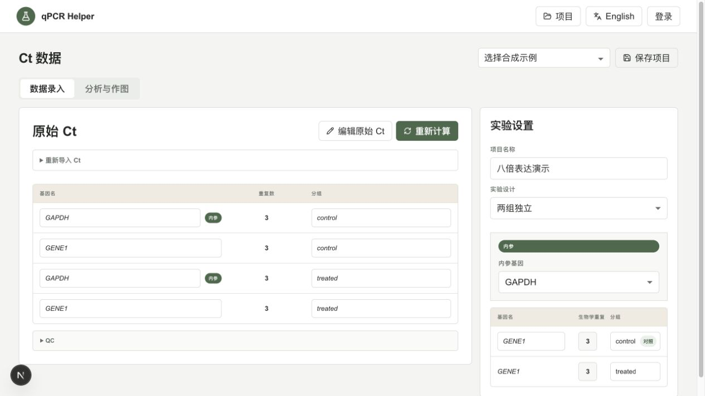
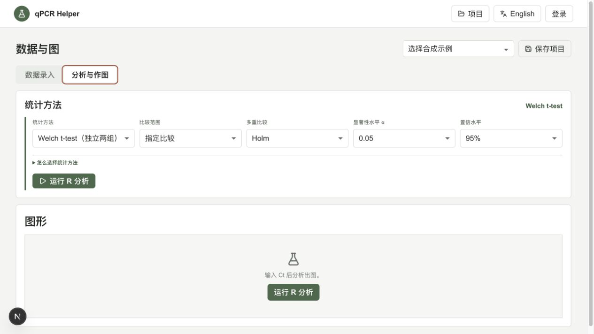
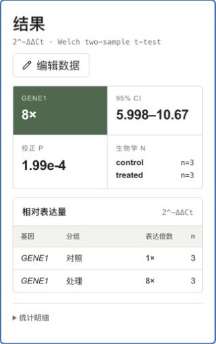
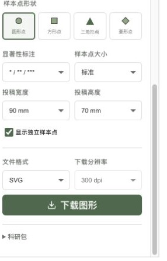

# Module guide / 模块说明

The screenshots use built-in demo data and follow the path from Ct input to a downloadable publication figure. Each module has one clear job, and the preview updates as settings change.

下面的截图使用内置演示数据，展示从 Ct 输入到投稿图下载的完整路径。每个模块只做一件事，切换设置后预览会即时更新。

## 1. 数据录入 / Data input

Paste well-level Ct/Cq values or import CSV/XLSX. The compact table shows gene, replicate count and group; technical replicates are QC-checked before biological n is counted.

粘贴逐孔 Ct/Cq，或导入 CSV/XLSX。紧凑表格显示基因名、重复数和分组；技术重复先经过 QC，统计 n 只按生物学重复计算。

## 2. 统计选择 / Statistical choice

Methods follow the experimental design. Choose Welch or paired t tests for two groups, or ANOVA + Tukey, Dunnett, or Games–Howell for multi-group data. The recommendation is visible and never silently changes the method.

统计方法随实验设计变化。两组可用 Welch 或配对 t 检验；多组可选 ANOVA + Tukey、Dunnett，方差不齐时可选 Games–Howell。软件只提供建议，不会悄悄替换你的选择。

## 3. 结果 / Results

The result card reports `2^-ΔΔCt`, confidence interval, adjusted p value and biological n. The table keeps group-level fold changes visible and can be recomputed after editing Ct values.

结果卡显示 `2^-ΔΔCt` 表达倍数、置信区间、校正 p 值和每组生物学 n。下方表格保留各基因和分组的表达量，修改原始 Ct 后可以重新计算。

## 4. 图形工作台 / Figure studio

R/ggplot2 renders bar-plus-points, dot, and violin-plus-box plots. Group colors stay consistent across gene facets; error bars, significance labels, point shape and size update live. The preview keeps the SVG aspect ratio instead of letterboxing it.

柱状图叠加独立点、散点图和小提琴叠加箱线图均由 R/ggplot2 生成。多基因分面中同一分组保持同色，误差线、显著性标记、点形状和尺寸都能即时调整；预览按 SVG 固有比例显示，不再被固定画布撑出空白。

## 5. 下载 / Download

Download SVG, PDF, PNG or TIFF directly; raster formats offer 300/600 dpi. A full research package is optional, so one figure can be saved without downloading everything.

直接选择 SVG、PDF、PNG 或 TIFF；位图可选 300/600 dpi。完整科研包按需下载，单张图形可以直接保存用于排版。
